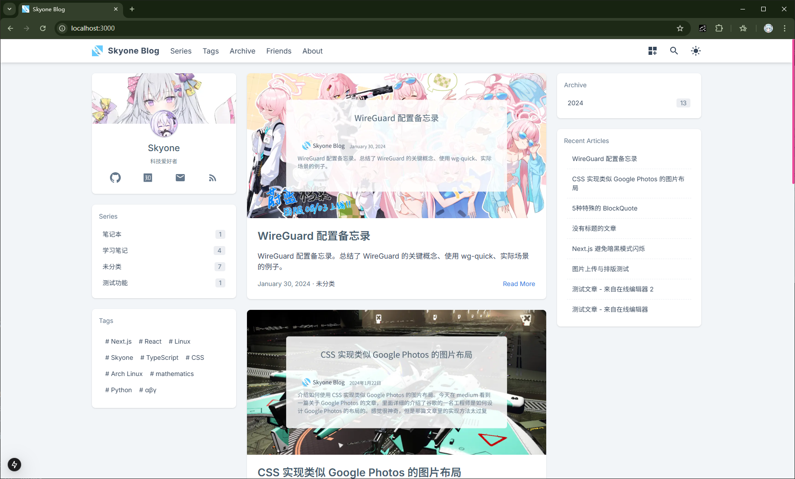
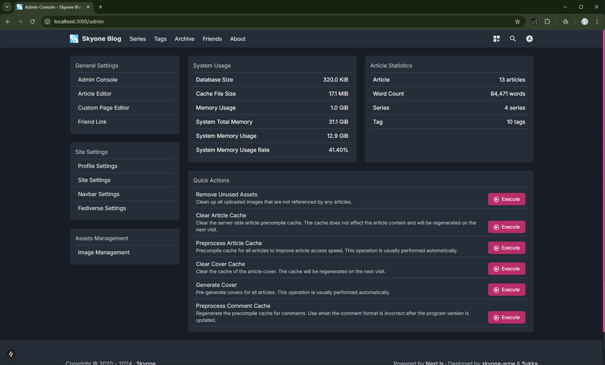
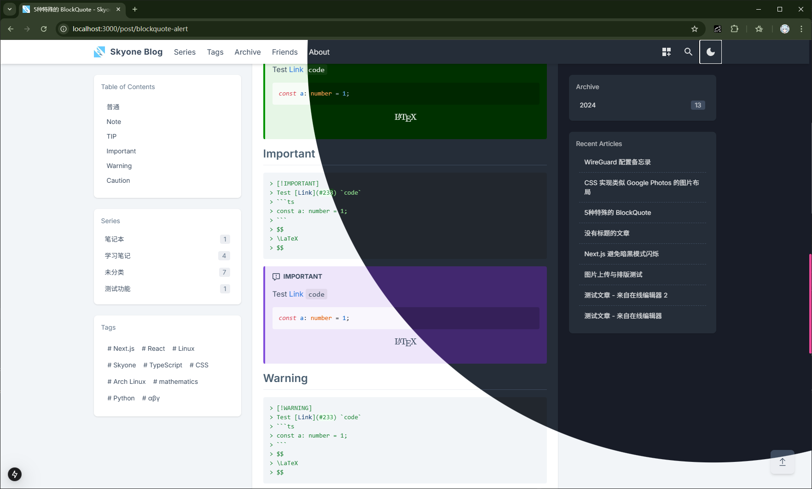
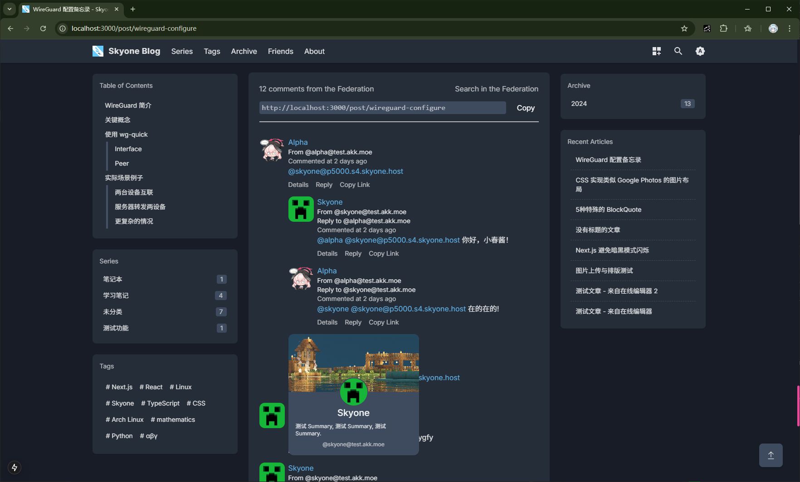

# Blog-Server

 

<p align="center"><a href="README.md">中文文档</a> | English</p>

<p align="center">A simple blog server. Based on Node.js, Next.js and SQLite.</p>



[MORE PREVIEWS](#more-previews)

> The project name has not been determined yet, maybe you can give me some suggestions?

## Features

* [x] Support WebFinger, [ActivityPub](https://en.wikipedia.org/wiki/ActivityPub) [Federated](https://en.wikipedia.org/wiki/Federation_(information_technology)) comment system (disabled by default)
* [x] Support GFM (GitHub Flavored Markdown)
* [x] Online editing articles
* [x] React Server Components
* [x] Multi-language support (based on `next-intl`)
* [x] Docker quick deployment
* [x] Custom website in the admin panel
* [x] Online upload custom cover
* [ ] Global search

There are many features that have not been implemented yet, but it has reached the level of normal use. Suggestions and code contributions are welcome. The database part should not have backward compatibility issues, but the configuration file and environment variables may change.

**Note:** The master branch is the development branch, which may have problems such as unable to run, incompatible database changes, etc. Please use the Release version.

~~Regarding memory usage, due to the use of Node.js and no special optimization
(lazy + don't know + for simple deployment), it is naturally incomparable with
compiled languages. About 220MB in idle state, and about 20MB additional usage
when rendering an article with 30,000 words containing a large number of mathematical
formulas (only the first rendering, less than 1 second), so a blog with small
traffic generally uses 300MB.~~

After several radical optimizations of the rendering logic, both memory usage
and rendering speed have been significantly improved, and the loss caused by
real-time rendering can be ignored.

## Quick Start

### Run using Docker

Download `docker-compose.yml` to your local

```shell
wget https://raw.githubusercontent.com/skyone-wzw/blog-server/master/docker-compose.yml
```

Edit environment variables (no need to modify for local testing)

* `DATABASE_URL`: Database file path, default is `file:./data/data.db`
* `DATA_DIR`: Data directory, default is `./data`
* `SECRET_KEY`: AES encryption key, required, a string of length 32
* `SECRET_IV`: AES encryption vector, required, a string of length 16
* `AUTH_EMAIL`: Backend login email, required
* `AUTH_PASSWORD`: Backend login password, required

```shell
docker-compose up -d
```

Open your browser and visit `http://localhost:3000`.

### Download precompiled version from Release

Download the latest precompiled version from [Release](https://github.com/skyone-wzw/blog-server/releases). Unzip to any directory, synchronize the database and start the server:

```shell
npm prisma generate
npm run start
```

Open your browser and visit `http://localhost:3000`.

### Build from source

Clone the repository and install dependencies

```shell
git clone https://github.com/skyone-wzw/blog-server.git --depth=1
cd blog-server
npm install
```

Build the project

```shell
npx prisma generate
npm run run patch-font
npm run build
```

Create work dir and copy the necessary files

```shell
cp -r .next/standalone build
cp -r .next/static build/.next/static
cp -r public build/public
```

Then flow the steps in [Download precompiled version from Release](#download-precompiled-version-from-release).

## Configuration

There are two configuration files: `.env` and `data/config.json`. Other custom content
(such as website title, logo, author, etc.) can be set in the website backend.

### Environment variables

You can set the data directory and database file path in the `.env` file
(located in the project root directory), the environment variables written
to this file will be automatically loaded, of course, setting environment
variables directly is also possible.

```ini
# Required
DATABASE_URL="file:./data/data.db"

# Optional, default is ./data
DATA_DIR=./data

# Optional, you can set it in data/config.json
SECRET_KEY="12345678123456781234567812345678"
SECRET_IV="1234567812345678"
AUTH_EMAIL=abc@example.com
AUTH_PASSWORD=123456
```

### Configure file

The `data/config.json` file (the data directory is specified by the environment variable `DATA_DIR`) is an alternative to environment variables. If you don't want to use environment variables, you can also choose a configuration file. But in any case, you must set the `DATABASE_URL` environment variable.

**Note: Environment variables take precedence over configuration files.**

Refer to the following example, all options are optional

```json
{
  "auth": {
    "email": "",
    "password": ""
  },
  "secret": {
    "key": "",
    "iv": ""
  },
  "dir": {
    "data": "./data",
    "image": "./data/post",
    "cover": "./data/cover",
    "random": "./data/cover/random",
    "custom": "./data/custom",
    "cache": "./data/cache"
  }
}
```

> Environment variables take precedence over configuration files, and environment
> variables are read after loading the configuration file, but `DATA_DIR` is
> an exception because the location of the configuration file is also determined by `DATA_DIR`.
> 
> In short, the configuration file is located at `$DATA_DIR/config.json`,
> and environment variables take precedence over the configuration file.

### Configuration item description

In environment variables:

* `DATA_DIR`: Data directory
* `DATABASE_URL`: Database file path, format is `file:/path/to/database.db`
* `SECRET_KEY`: AES encryption key
* `SECRET_IV`: AES encryption vector
* `AUTH_EMAIL`: Backend login email
* `AUTH_PASSWORD`: Backend login password

In configuration file:

* `auth.email`: Backend login email
* `auth.password`: Backend login password
* `secret.key`: AES encryption key
* `secret.iv`: AES encryption vector
* `dir.data`: Data directory, it is recommended to use the environment variable `DATA_DIR`
* `dir.image`: Image directory
* `dir.cover`: Cover directory
* `dir.random`: Random cover directory
* `dir.custom`: Custom directory
* `dir.cache`: Cache directory

## Article cover background image

By default, the article cover background image is random. You can put your image
in the `data/cover/random` directory. The image with the path `data/cover/[slug].(jpg|png|webp)`
will be used as the cover of the corresponding article. The specific matching rules are as follows:

1. Find `data/cover/[slug].(jpg|png|webp)`, if it exists, use it, if there are multiple formats, randomly select one
2. Find `data/cover/random/`, if it exists, randomly select one
3. If no image is found when the program starts, create `data/cover/random/default.webp` as the default image


## More Previews







## License

[MIT](LICENSE)
