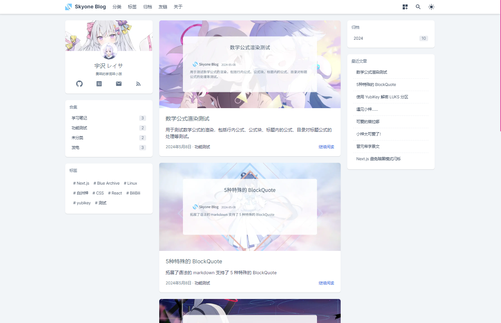

# Blog-Server

[中文](README.md)

<p align="center">A simple blog server based on Node.js, Next.js, and SQLite.</p>



> The project name is yet to be determined. Maybe you can give me some suggestions?


## Features

* [x] Supports GFM (GitHub Flavored Markdown)
* [x] Online article editing
* [x] React Server Components
* [x] Quick deployment with Docker

## Quick Start

### Running with Docker

Download `docker-compose.yml`

```shell
wget https://raw.githubusercontent.com/skyone-wzw/blog-server/master/docker-compose.yml
```

Edit environment variables (no changes needed for local testing)

- `DATABASE_URL`: Path to the database file, default is `file:./data/data.db`
- `DATA_DIR`: Data directory, default is `./data`
- `SECRET_KEY`: AES encryption key, required, a 32-character string
- `SECRET_IV`: AES encryption vector, required, a 16-character string
- `AUTH_EMAIL`: Admin login email, required
- `AUTH_PASSWORD`: Admin login password, required

```shell
docker-compose up -d
```

Open your browser and visit `http:localhost:3000`.

### Download Precompiled Version from Release

Download the latest precompiled version from [Release](https://github.com/skyone-wzw/blog-server/releases). Extract it to any directory, synchronize the database, and start the server:

```shell
npm prisma generate
npm run start
```

Open your browser and visit `http:localhost:3000`.

### Building from Source

> [!NOTE] Known issue: Memory leak during build (related to eslint@8 dependency). Awaiting fix, runtime is not affected.
>
> For local builds, at least 2GB of memory is required.

First, clone the repository and install dependencies

```shell
git clone https://github.com/skyone-wzw/blog-server.git --depth=1
cd blog-server
npm install
```

Build the program

```shell
npx prisma generate
npm run patch-font
npm run build
```

Create a runtime directory and copy build artifacts

```shell
mkdir build
cp -r public build/public
cp -r .next/standalone/* build
mkdir build/.next
cp -r .next/static build/.next/static
```

Follow the subsequent steps in [Download Precompiled Version from Release](#download-precompiled-version-from-release).

## Configuration

There are two configuration files: `.env` and `data/config.json`. Other custom content (such as site title, logo, author, etc.) can be set in the website backend.

### Environment Variables

In the `.env` file (located at the project root), you can set the data directory and the path to the database file. Environment variables written to this file will be automatically loaded, but you can also set them directly.

```ini
# Required
DATABASE_URL="file:./data/data.db"

# Optional, default is ./data
DATA_DIR=./data

# Optional, you can set it in data/config.json
SECRET_KEY="12345678123456781234567812345678"
SECRET_IV="1234567812345678"
AUTH_EMAIL=abc@example.com
AUTH_PASSWORD=123456
```

### Configuration File

The `data/config.json` file (data directory specified by the `DATA_DIR` environment variable) is an alternative to environment variables. If you prefer not to use environment variables, you can choose to use the configuration file. However, you must set the `DATABASE_URL` environment variable.

**Note: Environment variables take precedence over configuration file settings.**

Refer to the following example, all options are optional:

```json
{
  "auth": {
    "email": "",
    "password": ""
  },
  "secret": {
    "key": "",
    "iv": ""
  },
  "dir": {
    "data": "./data",
    "image": "./data/post",
    "cover": "./data/cover",
    "random": "./data/cover/random",
    "custom": "./data/custom"
  }
}
```

> Environment variables take precedence over the configuration file and are loaded after the configuration file, except for `DATA_DIR` because the location of the configuration file is also determined by `DATA_DIR`.
>
> In short, the configuration file is located at `$DATA_DIR/config.json`, and environment variables take precedence over the configuration file.

### Configuration Options

In environment variables:

- `DATA_DIR`: Data directory
- `DATABASE_URL`: Path to the database file, format: `file:/path/to/database.db`
- `SECRET_KEY`: AES encryption key
- `SECRET_IV`: AES encryption vector
- `AUTH_EMAIL`: Admin login email
- `AUTH_PASSWORD`: Admin login password

In the configuration file:

- `auth.email`: Admin login email
- `auth.password`: Admin login password
- `secret.key`: AES encryption key
- `secret.iv`: AES encryption vector
- `dir.data`: Data directory, it is recommended to use the `DATA_DIR` environment variable
- `dir.image`: Directory for article images, not recommended to modify
- `dir.cover`: Directory for article cover images, not recommended to modify
- `dir.random`: Directory for random article cover images, not recommended to modify
- `dir.custom`: Directory for custom files, not recommended to modify

## Article Cover Images

Currently, there is no frontend upload feature. You can upload images to the server via FTP or other methods.

By default, article cover images are random. You can place your images in the `data/cover/random` directory. Images with the path `data/cover/[slug].(jpg|png|webp)` will be used as the cover for the corresponding article. The matching rules are as follows:

1. Look for `data/cover/[slug].(jpg|png|webp)`, if exists, use it; if multiple formats exist, one will be randomly chosen.
2. Look in `data/cover/random/`, if exists, a random image will be chosen.
3. If no images are found when the program starts, `data/cover/random/default.webp` will be created as the default image.

## Open Source License

[MIT](LICENSE)
